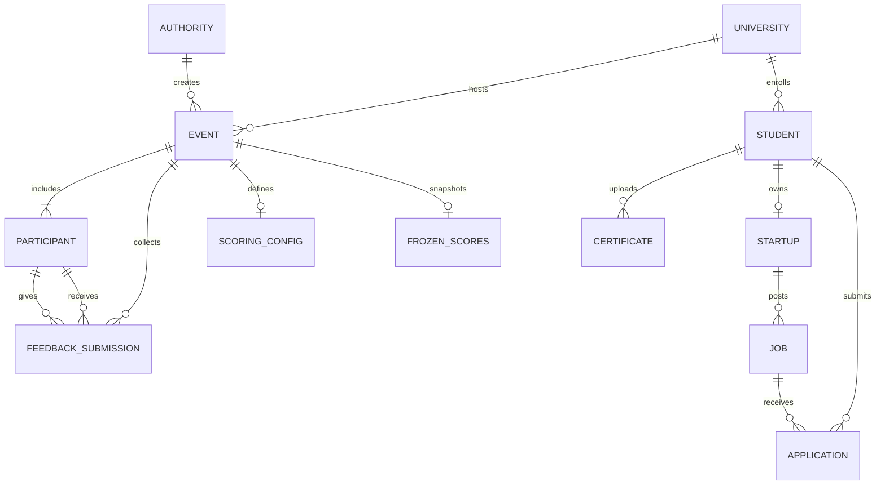

# Beyond Grades data model

`SCORING_CONFIG` stores the admin-entered scale, level ranks, committee weights, relevance grid, credibility constants, confidence prior, skill weights, and the rules for medians, blanks, self-ratings, cross-event combination, whether the event contributes to EPA, late reviews, comment visibility, whether the organizer can see who reviewed whom, and an optional minimum review count. The scorer does not fill those values in.

`EVENT` stores the calendar dates and the feedback window: `openAt`, `closeAtTentative`, and `closeAtActual`. The window is separate from the event start and end dates. `lateSubmissions` on the scoring config decides whether reviews are accepted after the planned close.

`FEEDBACK_SUBMISSION` stores one row per rater, ratee, and event. Each rating has a skill, a numeric score, a skipped flag, and an optional comment. A skipped skill is stored, and it is not a finished review. A rating for a skill the organizer later removed does not count as a current review.

`FROZEN_SCORES` is written when an authority closes the event, and again when they recalculate. Older snapshots stay in `frozenScoreHistory`. Both are stored on the event, not in a separate collection. Removing a participant before the event is closed also removes the reviews they gave and received.

`STUDENT` stores the public-profile switches, including name and photo, and the hash of the current share link. The raw link is not stored. A revoked link no longer resolves. Leaderboard rows and skill trends are calculated from event scores and are not stored.

`JOB` has an open flag. Closing a posting removes it from the open list and keeps the applications on that job.

`CERTIFICATE` stores an optional `issuedOn` date. A blank date stays empty, and an impossible date is rejected.
